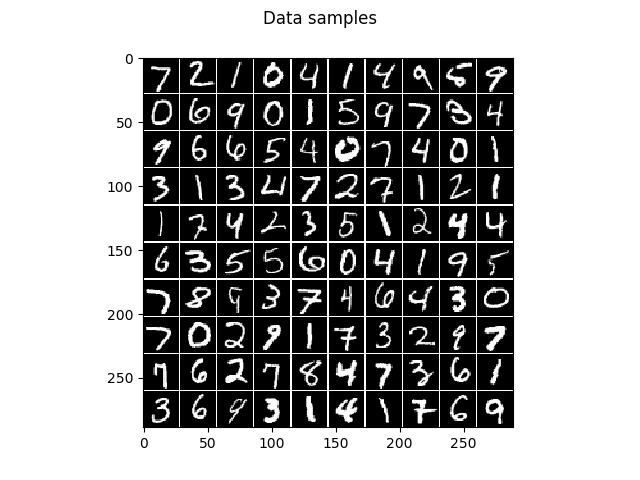
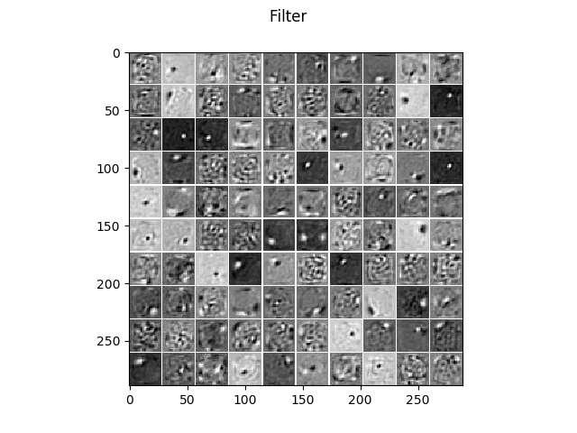
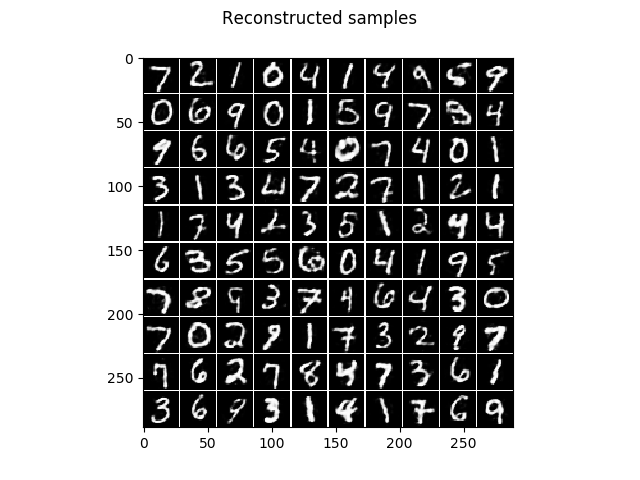
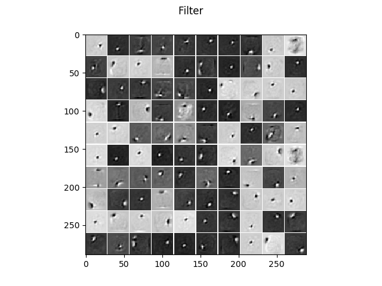

.. _AE_MNIST:

Autoencoder on MNIST
==========================================================

Example for training a centered Autoencoder on the MNIST handwritten digit dataset with and without contractive penalty,
dropout, ...

It allows to reproduce the results from the publication `How to Center Deep Boltzmann Machines. Melchior et al. JMLR 2016. <http://jmlr.org/papers/v17/14-237.html>`_.

Theory
***********

If you are new on Autoencoders visit `Autoencoder tutorial <http://ufldl.stanford.edu/wiki/index.php/Autoencoders_and_Sparsity>`_ or watch the video course by Andrew Ng.

.. raw:: html

    

      <iframe width="560" height="315" src="https://www.youtube.com/embed/vfnxKO2rMq4" frameborder="0" allowfullscreen></iframe>
    

Results
***********

The code_ given below produces the following output that is quite similar to the results produced by an RBM.

Visualization of 100 test samples.

The learned filters without regularization.

The corresponding reconstruction of the model, that is the encoding followed by the decoding.

The learned filters when a contractive penalty is used, leading to much more localized and less noisy filters.

And the corresponding reconstruction of the model.

See also `RBM_MNIST_big <RBM_MNIST_big.html#RBM_MNIST_big>`__.

.. _code:

Source code
***********

.. figure:: images/download_icon.png
   :scale: 20 %
   :target: https://github.com/MelJan/PyDeep/blob/master/examples/AE_MNIST.py

.. literalinclude:: ../../examples/AE_MNIST.py