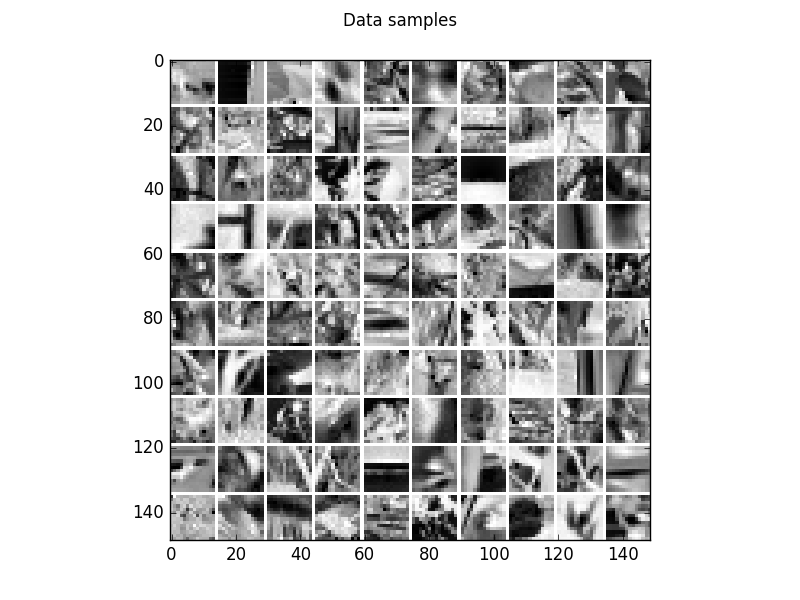
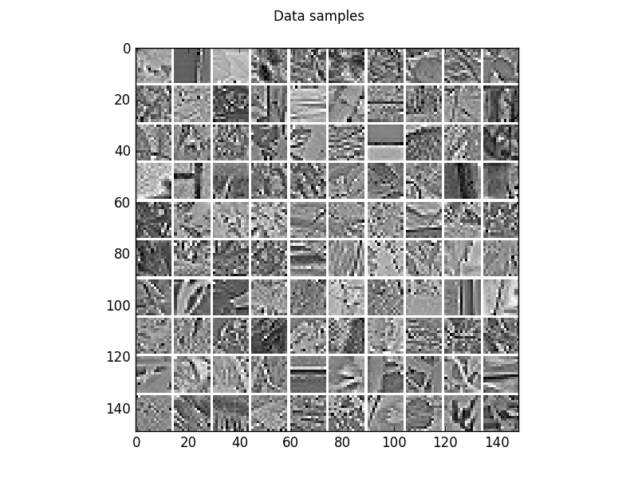
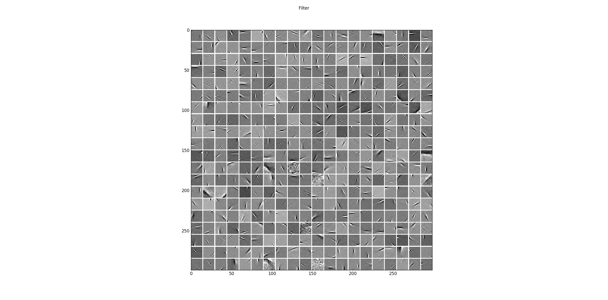
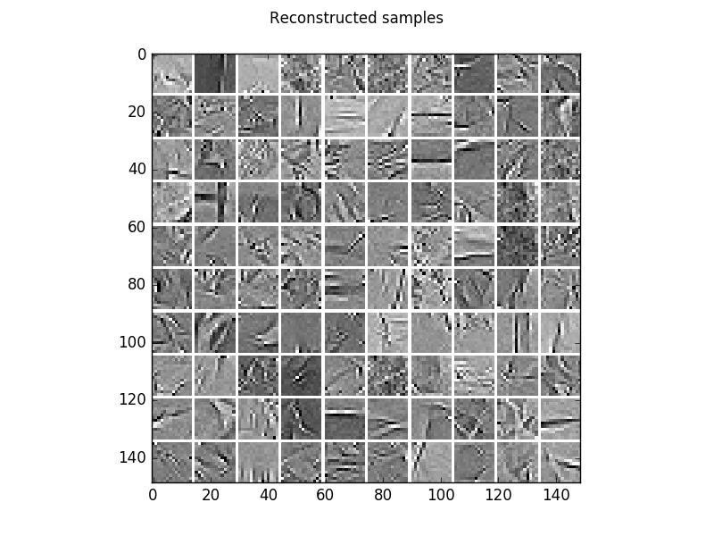
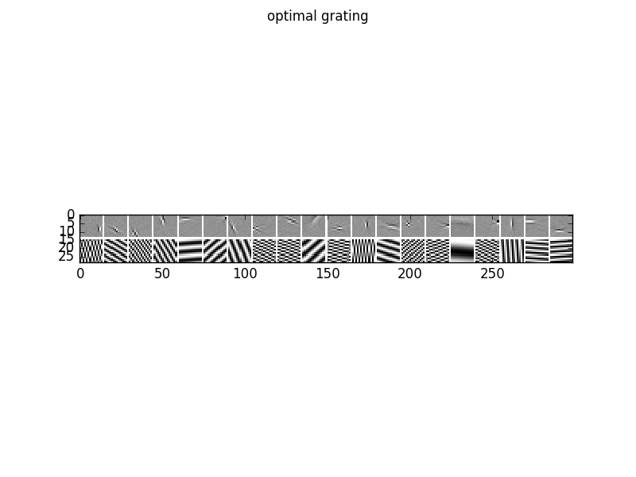
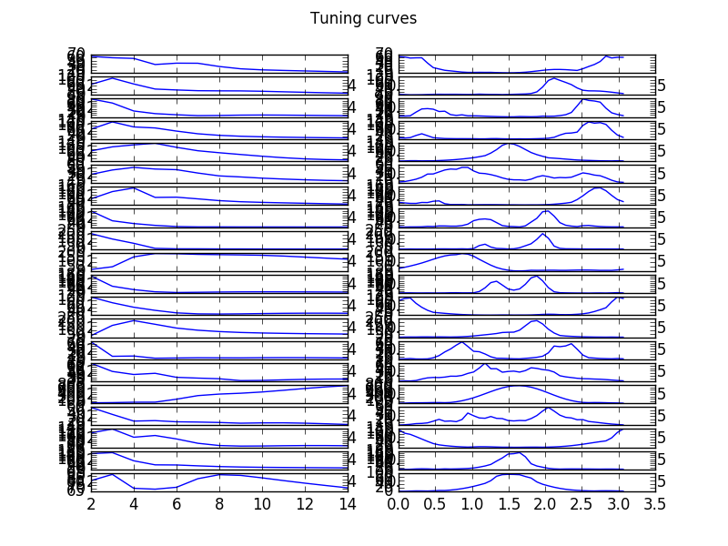
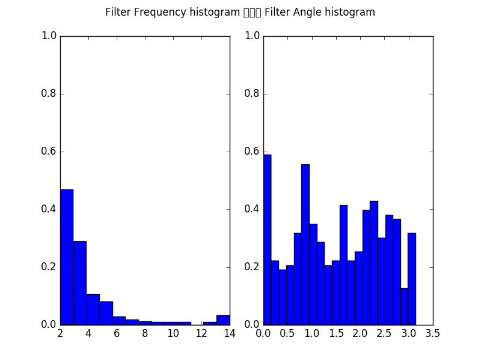
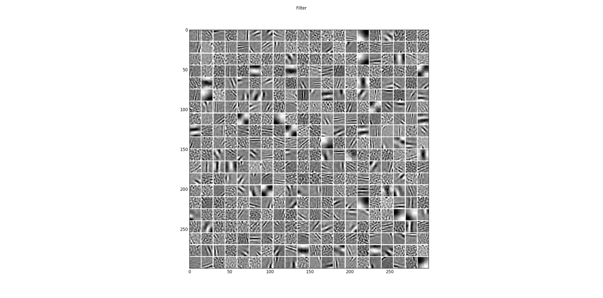

.. _AE_Natural_Images:

Autoencoder on a natural image patches
==========================================================

Example for Autoencoders (`Autoencoder <https://en.wikipedia.org/wiki/Autoencoder>`_) on natural image patches.

Theory
***********

If you are new on Autoencoders visit `Autoencoder tutorial <http://ufldl.stanford.edu/wiki/index.php/Autoencoders_and_Sparsity>`_ or watch the video course by Andrew Ng.

.. raw:: html

    

      <iframe width="560" height="315" src="https://www.youtube.com/embed/vfnxKO2rMq4" frameborder="0" allowfullscreen></iframe>
    

Results
***********

The code_ given below produces the following output that is impressively similar to the results produced by ICA or GRBMs.

Visualization of 100 examples of the gray scale natural image dataset.

The corresponding whitened image patches.

The learned filters from the whitened natural image patches.

The corresponding reconstruction of the model, that is the encoding followed by the decoding.

To analyze the optimal response of the learn filters we can fit a Gabor-wavelet parametrized in angle and frequency, and plot
the optimal grating, here for 20 filters

as well as the corresponding tuning curves, which show the responds/activities as a function frequency in pixels/cycle (left) and angle in rad (right).

Furthermore, we can plot the histogram of all filters over the frequencies in pixels/cycle (left) and angles in rad (right).

We can also train the model on the unwhitened data leading to the following filters that cover also lower frequencies.

See also `GRBM_natural_images <GRBM_natural_images.html#GRBM_natural_images>`__,
and `ICA_natural_images <ICA_natural_images.html#ICA_natural_images>`__.

.. _code:

Source code
***********

.. figure:: images/download_icon.png
   :scale: 20 %
   :target: https://github.com/MelJan/PyDeep/blob/master/examples/AE_natural_images.py

.. literalinclude:: ../../examples/AE_natural_images.py