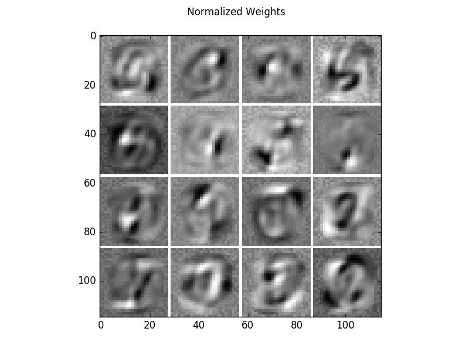
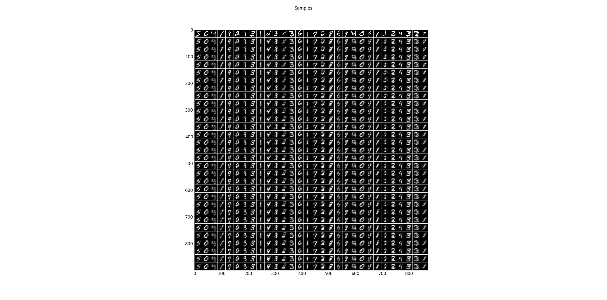
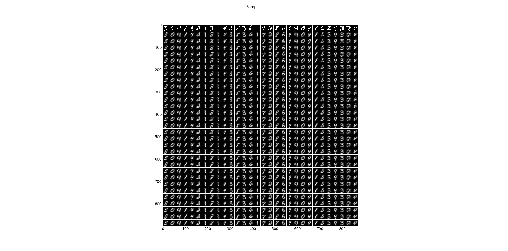

Small centered/normal binary RBM on MNIST
==========================================================

Example for training a centered and normal Binary Restricted Boltzmann machine on the MNIST handwritten digit dataset and the flipped version.
The model is small enough to calculate the exact Log-Likelihood and annealed importance sampling and reverse annealed importance sampling are evaluated.

For an analysis of advantage of centering in RBMs see `How to Center Deep Boltzmann Machines. Melchior, J., Fischer, A., & Wiskott, L.. (2016). Journal of Machine Learning Research, 17(99), 1–61. <http://jmlr.org/papers/v17/14-237.html>`_

The code_ given below produces the following output.

Learned filters of a centered binary RBM on the MNIST dataset.

Sampling results for some examples. The first row shows training data and the following rows are the results after one Gibbs-sampling step starting from the previous row.

The Log-Likelihood is calculated using the exact Partition function, an annealed importance sampling estimation (optimistic) and reverse annealed importance sampling estimation (pessimistic).

.. code-block:: Python

   Training
   Epoch    Recon. Error   Log likelihood  Expected End-Time
   10       0.0519         -152.8375       2017-04-22 19:19:20.492937
   20       0.0512         -144.6574       2017-04-22 19:19:18.518975
   30       0.0510         -143.9597       2017-04-22 19:19:18.118906
   End-time:                               2017-04-22 19:19:06.424132
   Training time:          0:03:37.913801
   True Partition:         332.061422631 (LL: -143.295691625)
   AIS Partition:          331.856312898 (LL: -143.090581892)
   reverse AIS Partition:  333.975682243 (LL: -145.209951237)

The code can also be executed without centering by setting

.. code-block:: python

   update_offsets = 0.0

Resulting in the following weights and sampling steps.

.. figure:: images/BRBM_small_normal_weights.png
   :scale: 75 %
   :alt: weights normal

Sampling results for some examples. The first row shows training data and the following rows are the result after one Gibbs-sampling step.

The Log-Likelihood for this model is significantly worse (8 nats lower).

.. code-block:: Python

   Epoch    Recon. Error   Log likelihood  Expected End-Time
   10       0.0550         -153.1939       2017-04-22 19:48:31.196758
   20       0.0538         -158.0558       2017-04-22 19:48:30.991562
   30       0.0534         -154.9978       2017-04-22 19:48:31.701043
   End-time:                               2017-04-22 19:48:17.356501
   Training time:          0:03:51.361354
   True Partition:         209.93080041  (LL: -151.678071606)
   AIS Partition:          209.922151068 (LL: -151.669422263)
   reverse AIS Partition:  209.55108856  (LL: -151.298359755)

Further, the models can be trained on the flipped version of MNIST (1-MNIST).

.. code-block:: python

   flipped = True

.. _code:

While the centerer model has a similar performance on the flipped version,

.. code-block:: Python

   Epoch    Recon. Error  Log likelihood  Expected End-Time
   10       0.0520        -145.0683       2017-04-22 20:10:32.506455
   20       0.0513        -143.1599       2017-04-22 20:10:41.450600
   30       0.0510        -143.4857       2017-04-22 20:10:40.404681
   End-time:                              2017-04-22 20:10:29.587139
   Training time:         0:08:21.800137
   True Partition:        330.041980724 (LL: -142.715842237)
   AIS Partition:         329.78134331  (LL: -142.455204822)
   reverse AIS Partition: 331.047724145 (LL: -143.721585658)

.. figure:: images/BRBM_small_centered_weights_flipped.png
   :scale: 75 %
   :alt: flipped filters centered

Sampling results for some examples. The first row shows training data and the following rows are the result after one Gibbs-sampling step.

.. figure:: images/BRBM_small_centered_samples_flipped.png
   :scale: 75 %
   :alt: flipped samples centered

the normal RBM fails to learn the distribution.

.. code-block:: Python

   Epoch    Recon. Error  Log likelihood  Expected End-Time
   10       0.0588        -183.3271       2017-04-22 20:10:26.751454
   20       0.0580        -206.4093       2017-04-22 20:10:35.824502
   30       0.0576        -180.9389       2017-04-22 20:10:33.400136
   End-time:                              2017-04-22 20:10:12.549085
   Training time:         0:07:56.808453
   True Partition:        3755.27224976 (LL: -193.127765428)
   AIS Partition:         3755.25179256 (LL: -193.10730823)
   reverse AIS Partition: 3755.18060949 (LL: -193.036125159)

.. figure:: images/BRBM_small_normal_weights_flipped.png
   :scale: 75 %
   :alt: flipped filters normal

.. figure:: images/BRBM_small_normal_samples_flipped.png
   :scale: 75 %
   :alt: flipped samples normal

Source code
***********

.. literalinclude:: ../../examples/RBM_binary_MNIST_small.py