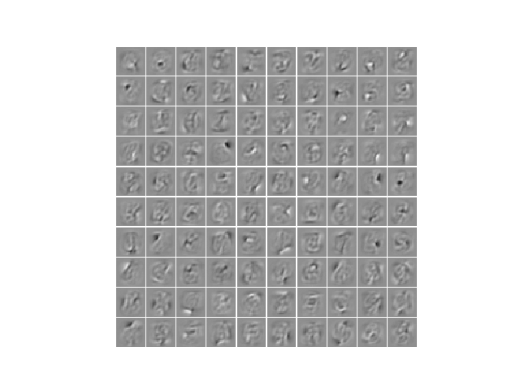
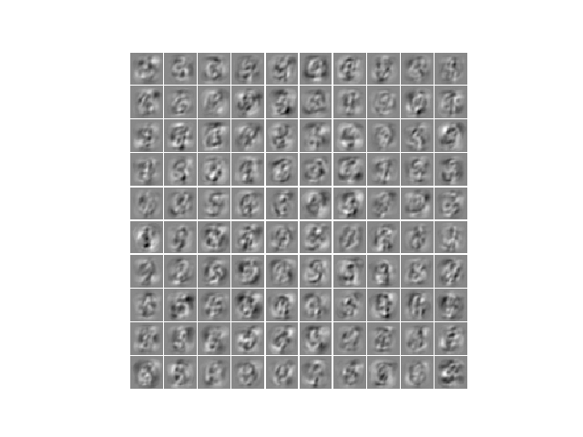
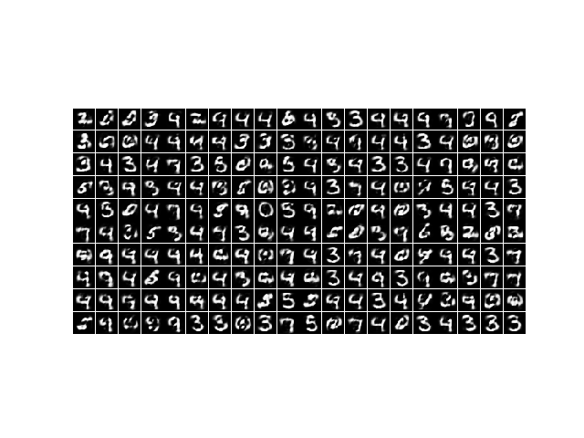

.. _DBM_MNIST:

Deep Boltzmann machines on MNIST
==========================================================

Example for training a centered Deep Boltzmann machine on the MNIST handwritten digit dataset.

It allows to reproduce the results from the publication `How to Center Deep Boltzmann Machines. Melchior et al. JMLR 2016. <http://jmlr.org/papers/v17/14-237.html>`_.

Results
***********

The code_ given below produces the following output that is quite similar to the results produced by an RBM.

The learned filters of the first layer

The learned filters of the second layer, linearly back projected

Some generated samples

See also `RBM_MNIST_big <RBM_MNIST_big.html#RBM_MNIST_big>`__.

.. _code:

Source code
***********

.. figure:: images/download_icon.png
   :scale: 20 %
   :target: https://github.com/MelJan/PyDeep/blob/master/examples/DBM_MNIST.py

.. literalinclude:: ../../examples/DBM_MNIST.py