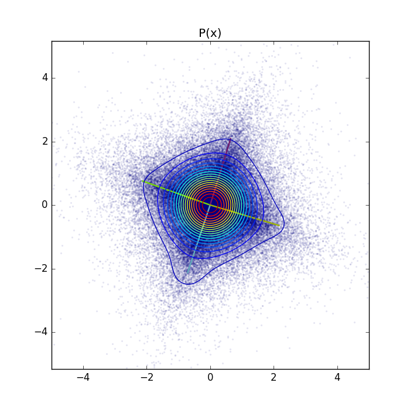
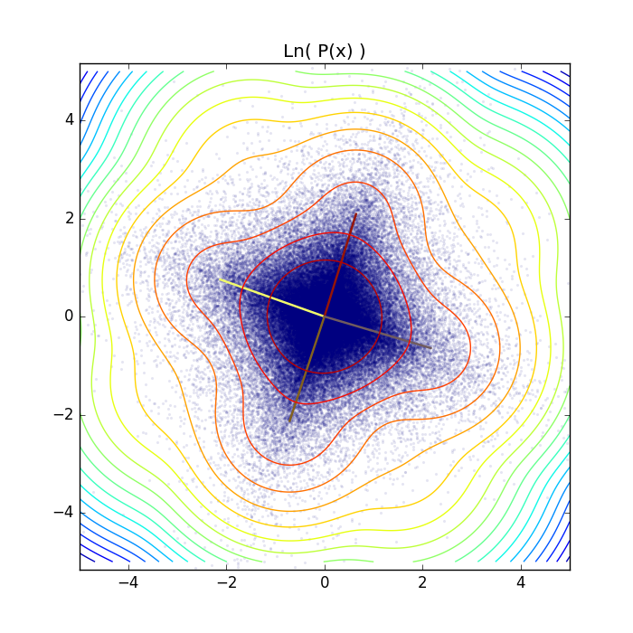
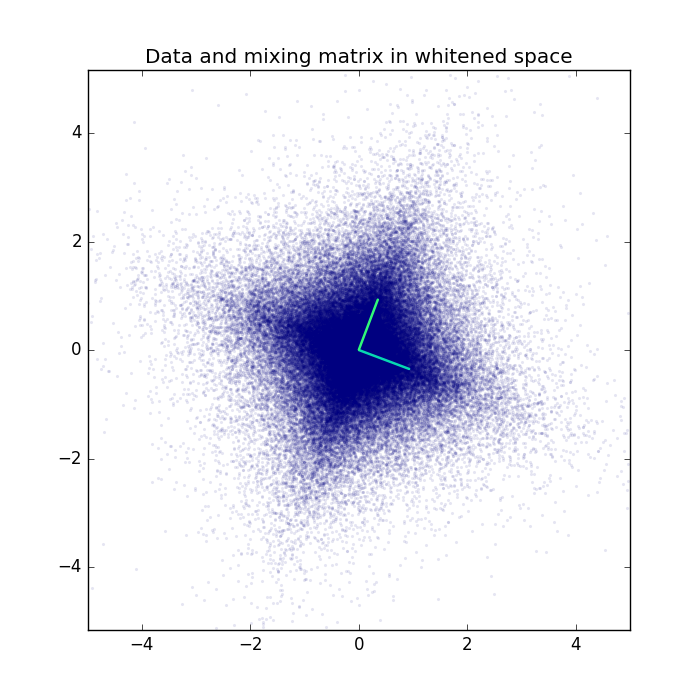
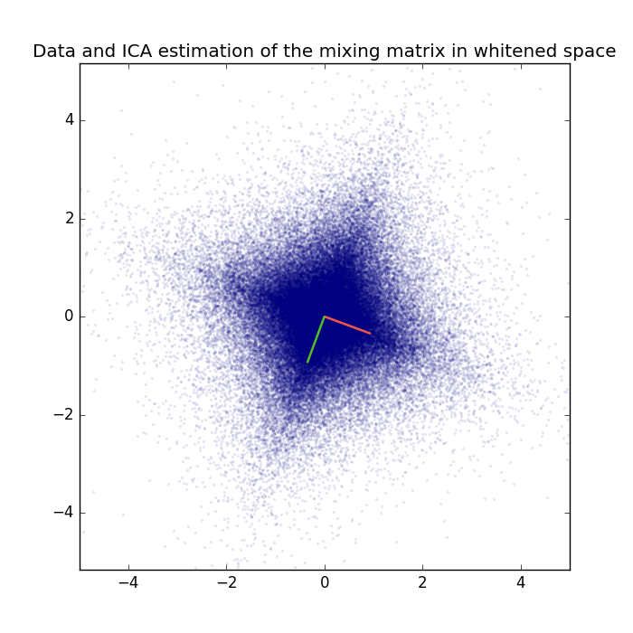

.. _GRBM_2D_example:

Gaussian-binary restricted Boltzmann machine on a 2D linear mixture.
=======================================================

Example for Gaussian-binary restricted Boltzmann machine used for blind source separation on a linear 2D mixture.

Theory
***********

The results are part of the publication `Gaussian-binary restricted Boltzmann machines for modeling natural image statistics. Melchior, J., Wang, N., & Wiskott, L.. (2017). PLOS ONE, 12(2), 1–24. <http://doi.org/10.1371/journal.pone.0171015>`_ .

If you are new on GRBMs, you can have a look into my `master's theses <https://www.ini.rub.de/PEOPLE/wiskott/Reprints/Melchior-2012-MasterThesis-RBMs.pdf>`_

See also `ICA_2D_example <ICA_2D_example.html#ICA_2D_example>`__

Results
***********

The code_ given below produces the following output.

Visualization of the weight vectors learned by the GRBM with 4 hidden units together with the contour plot of the learned probability density function (PDF).

For a better visualization also the log-PDF.

The parameters values and the component scaling values P(h_i) are as follows:

.. code-block:: bash

   Weigths:
   [[-2.13559806 -0.71220501  0.64841691  2.17880554]
    [ 0.75840129 -2.13979672  2.09910978 -0.64721076]]
   Visible bias:
   [[ 0.  0.]]
   Hidden bias:
   [[-7.87792514 -7.60603139 -7.73935758 -7.722771  ]]
   Sigmas:
   [[ 0.74241256  0.73101419]]

   Scaling factors:
   P(h_0) [[ 0.83734074]]
   P(h 1 ) [[ 0.03404849]]
   P(h 2 ) [[ 0.04786942]]
   P(h 3 ) [[ 0.0329518]]
   P(h 4 ) [[ 0.04068302]]

The exact log-likelihood, annealed importance sampling estimation, and reverse annealed importance sampling estimation for training and test data are:

.. code-block:: bash

   True log partition:   1.40422867085  ( LL_train:  -2.74117592643 , LL_test:  -2.73620936613  )
   AIS  log partition:   1.40390312781  ( LL_train:  -2.74085038339 , LL_test:  -2.73588382309  )
   rAIS  log partition:  1.40644042744  ( LL_train:  -2.74338768302 , LL_test:  -2.73842112273  )

For comparison here is the original mixing matrix an the corresponding ICA estimation.

The exact log-likelihood for ICA is almost the same as that for the GRBM with 4 hidden units.

.. code-block:: bash

   ICA log-likelihood on train data: -2.74149951412
   ICA log-likelihood on test data:  -2.73579105422

We can also calculate the Amari distance between true mixing , the ICA estimation, and the GRBM estimation.
Since the GRBM has learned 4 weight vectors we calculate teh Amari distance between the true mixing matrix and all sets of 2 weight-vectors of the GRBM.

.. code-block:: bash

   Amari distance between true mixing matrix and ICA estimation:             0.00621143307663
   Amari distance between true mixing matrix and GRBM weight vector 1 and 2: 0.0292827450487
   Amari distance between true mixing matrix and GRBM weight vector 1 and 3: 0.0397992351592
   Amari distance between true mixing matrix and GRBM weight vector 1 and 4: 0.336416964036
   Amari distance between true mixing matrix and GRBM weight vector 2 and 3: 0.435997388341
   Amari distance between true mixing matrix and GRBM weight vector 2 and 4: 0.0557649366433
   Amari distance between true mixing matrix and GRBM weight vector 3 and 4: 0.0666442992135

Weight-vectors 1 and 4 as well as 2 and 3 are almost 180 degrees rotated version of each other, which can also be seen
from the weight matrix values given above and thus the Amari distance to the mixing matrix is high.

For a real-world application see the `GRBM_natural_images <GRBM_natural_images.html#GRBM_natural_images>`__ example.

.. _code:

Source code
***********

.. figure:: images/download_icon.png
   :scale: 20 %
   :target: https://github.com/MelJan/PyDeep/blob/master/examples/GRBM_2D.py

.. literalinclude:: ../../examples/GRBM_2D.py