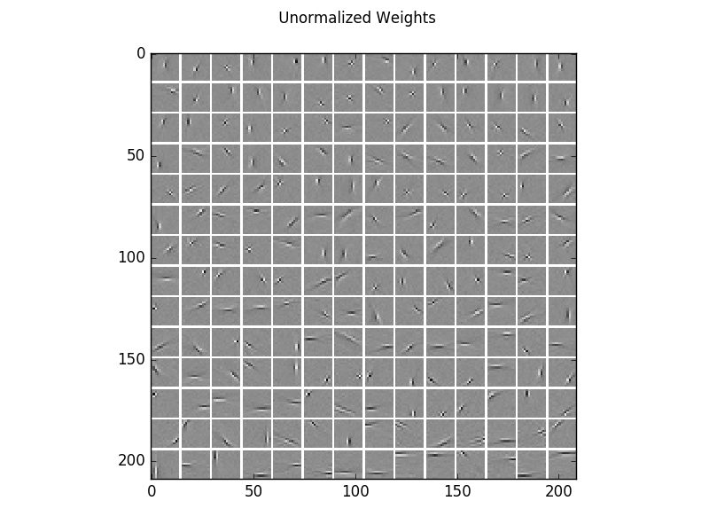
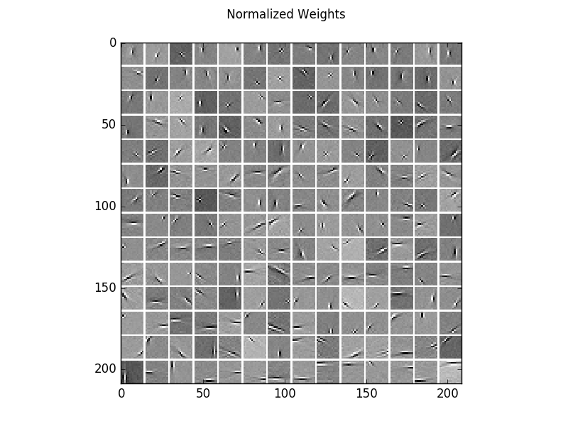
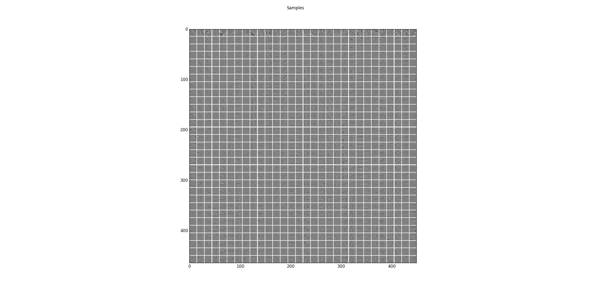
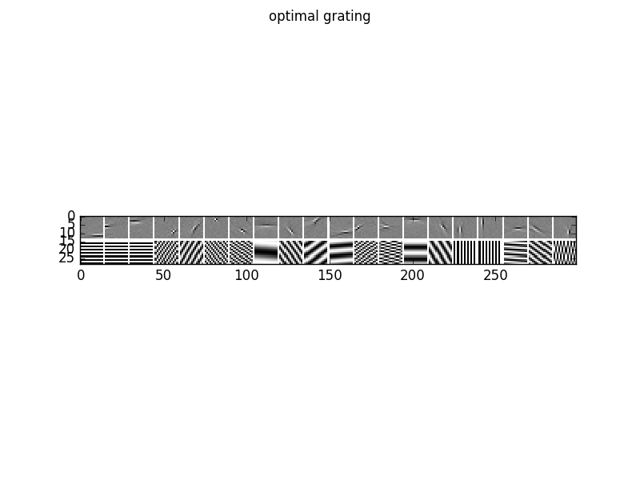
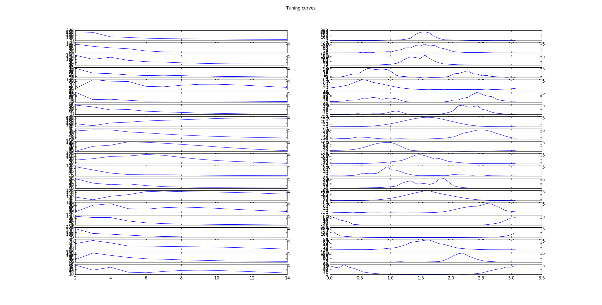
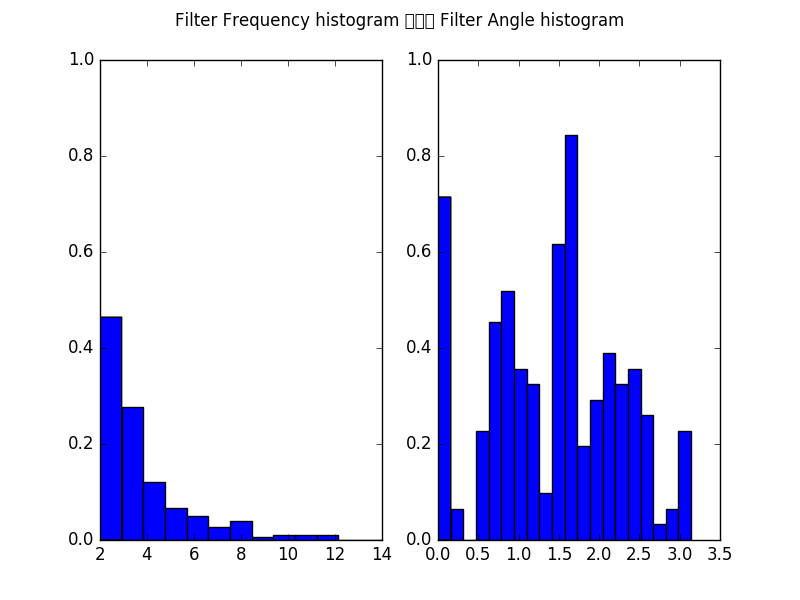

.. _ICA_Natural_Images:

Gaussian-binary restricted Boltzmann machine on natural image patches
==========================================================

Example for a Gaussian-binary restricted Boltzmann machine (GRBM) on a natural image patches.
The learned filters are similar to those of ICA, see also `ICA_natural_images <ICA_natural_images.html#ICA_natural_images>`__.

Theory
***********

If you are new on GRBMs, first see `GRBM_2D_example <GRBM_2D_example.html#GRBM_2D_example>`__.

For a theoretical and empirical analysis of on GRBMs on natural image patches see `Gaussian-binary restricted Boltzmann machines for modeling natural image statistics. Melchior et. al. PLOS ONE 2017 <http://doi.org/10.1371/journal.pone.0171015>`_

Results
***********

The code_ given below produces the following output.

Visualization of the learned filters, which are very similar to those of ICA.

For a better visualization of the structure, here are the same filters normalized independently.

Sampling results for some examples. The first row shows some training data and the following rows are the results after one step of Gibbs-sampling starting from the previous row.

The log-likelihood and reconstruction error for training and test data

.. code-block:: Python

                Epoch	RE train	RE test 	LL train	LL test
   AIS:         200 	0.73291 	0.75427 	-268.34107 	-270.82759
   reverse AIS:         0.73291 	0.75427 	-268.34078 	-270.82731

To analyze the optimal response of the learn filters we can fit a Gabor-wavelet parametrized in angle and frequency, and plot
the optimal grating, here for 20 filters

as well as the corresponding tuning curves, which show the responds/activities as a function frequency in pixels/cycle (left) and angle in rad (right).

Furthermore, we can plot the histogram of all filters over the frequencies in pixels/cycle (left) and angles in rad (right).

Compare the results with thos of `ICA_natural_images <ICA_natural_images.html#ICA_natural_images>`__,
and `AE_natural_images <AE_natural_images.html#AE_natural_images>`__..

.. _code:

Source code
***********

.. figure:: images/download_icon.png
   :scale: 20 %
   :target: https://github.com/MelJan/PyDeep/blob/master/examples/GRBM_natural_images.py

.. literalinclude:: ../../examples/GRBM_natural_images.py