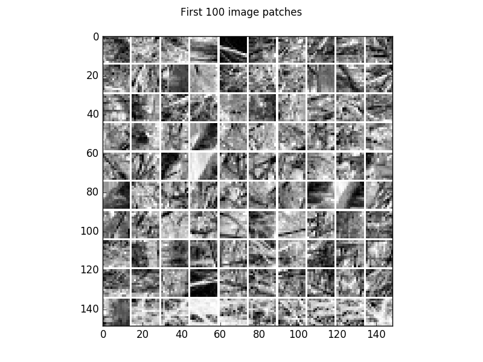
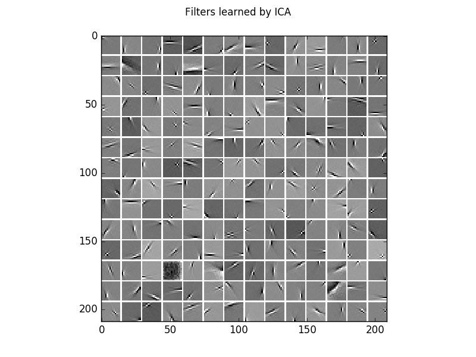

.. _ICA_Natural_Images:

Gaussian-binary restricted Boltzmann machine on a natural image patches
==========================================================

Example for Independent Component Analysis (`ICA <https://en.wikipedia.org/wiki/Principal_component_analysis>`_)
on natural image patches. The independent components (columns of the ICA projection matrix) of natural image patches are edge detector filters.

Theory
***********

If you are new on ICA and blind source separation, a good theoretical introduction is given by `Course Material ICA <https://www.ini.rub.de/PEOPLE/wiskott/Teaching/Material/index.html>`_ and in the following videos.

See also `ICA_2D_example <ICA_2D_example.html#ICA_2D_example>`__.

Results
***********

The code_ given below produces the following output.

Visualization of 100 examples of the gray scale natural image dataset.

The corresponding whitened image patches.

.. figure:: images/ICA_natural_images_data_whitened.png
   :scale: 75 %
   :alt: 100 gray scale natural image patch examples whitend

The learned filters/independent components learned from the whitened natural image patches.

See `Gaussian-binary restricted Boltzmann machines for modeling natural image statistics. Melchior, J., Wang, N., & Wiskott, L.. (2017). PLOS ONE, 12(2), 1–24. <http://doi.org/10.1371/journal.pone.0171015>`_
for a analysis of ICA and GRBM.

Epoch	RE train	RE test 	LL train	LL test
  200 	0.73291 	0.75427 	-268.34107 	-270.82759
  200 	0.73291 	0.75427 	-268.34078 	-270.82731

  200 	0.73822 	0.75864 	-268.87957 	-271.34223
  200 	0.73822 	0.75864 	-268.86811 	-271.33077

.. _code:

Source code
***********

.. figure:: images/download_icon.png
   :scale: 20 %
   :target: https://github.com/MelJan/PyDeep/blob/master/examples/ICA_natural_images.py

.. literalinclude:: ../../examples/ICA_natural_images.py