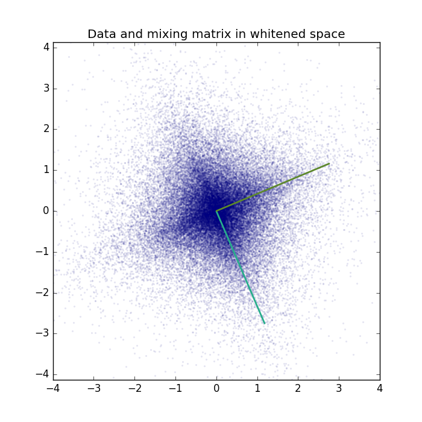
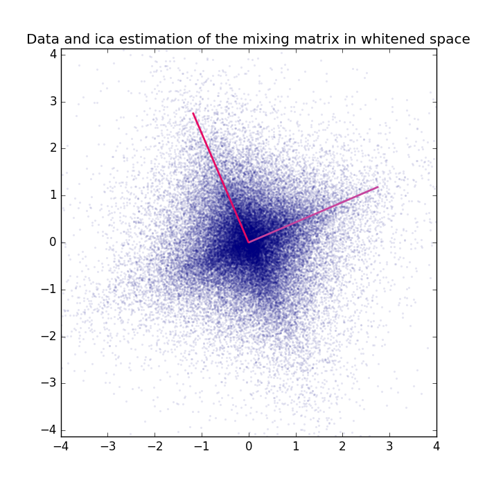
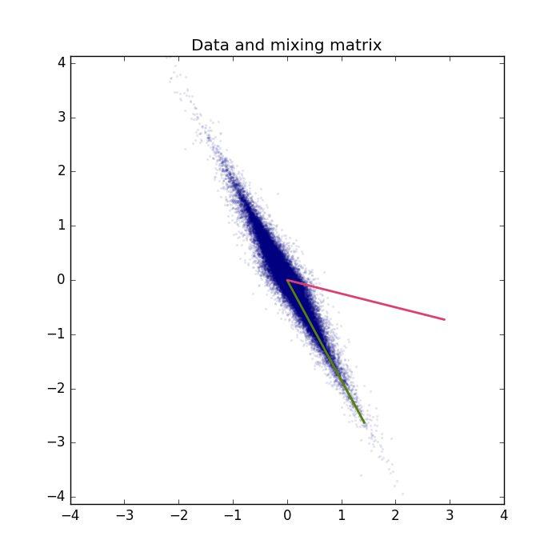
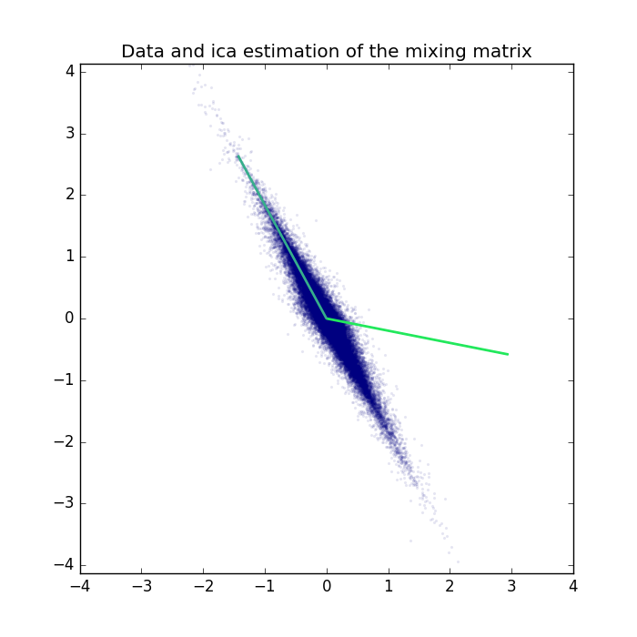

.. _ICA_2D_example:

Independent Component Analysis on a 2D example.
=======================================================

Example for Independent Component Analysis (`ICA <https://en.wikipedia.org/wiki/Principal_component_analysis>`_) used for blind source separation on a linear 2D mixture.

If you are new on ICA and blind source separation, a good theoretical introduction is given by `Course Material ICA <https://www.ini.rub.de/PEOPLE/wiskott/Teaching/Material/index.html>`_ .
As well as a video lecture on linear mixtures and blind source separation

.. raw:: html

    

      <iframe width="560" height="315" src="http://www.youtube.com/embed/3eWuUWODE4o" frameborder="0" allowfullscreen></iframe>
    

and the follow up video giving an introduction to ICA.

.. raw:: html

    

      <iframe width="560" height="315" src="http://www.youtube.com/embed/ugiMhRbFnTo" frameborder="0" allowfullscreen></iframe>
    

Results
***********

The code_ given below produces the following output.

Visualization of the data and true mixing matrix projected to the whitened space.

Visualization of the whitened data with the ICA projection matrix, that is the estimation of the whitened mixing matrix.
Note that ICA is invariant to sign flips of the sources. Thus the columns of the estimated mixing matrix are most likely a permutation of the columns of the original mixing matrix's and can also be a 180 degrees rotated version (original vector multiplied by -1).

We can also project the ICA projection matrix back to the original space and compare the results in the original space.

For a real-world application see the `ICA_natural_images <ICA_natural_images.html#_ICA_Natural_Images>`__ example.

Source code
***********

.. figure:: images/download_icon.png
   :scale: 20 %
   :target: https://github.com/MelJan/PyDeep/blob/master/examples/ICA_2D.py

.. literalinclude:: ../../examples/ICA_2D.py