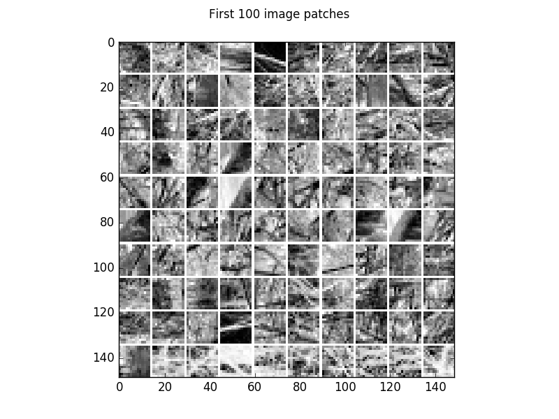
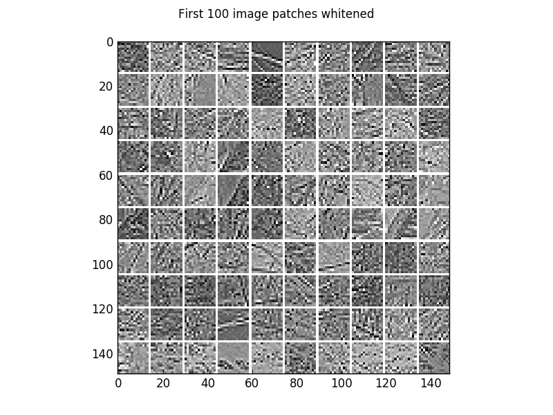
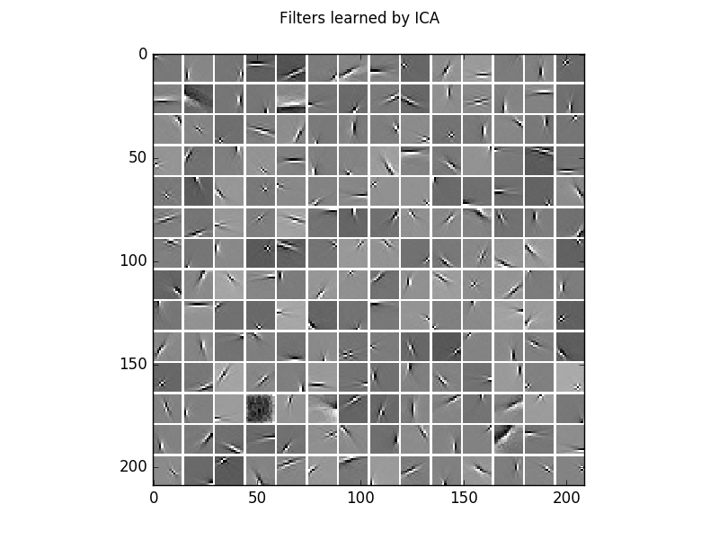
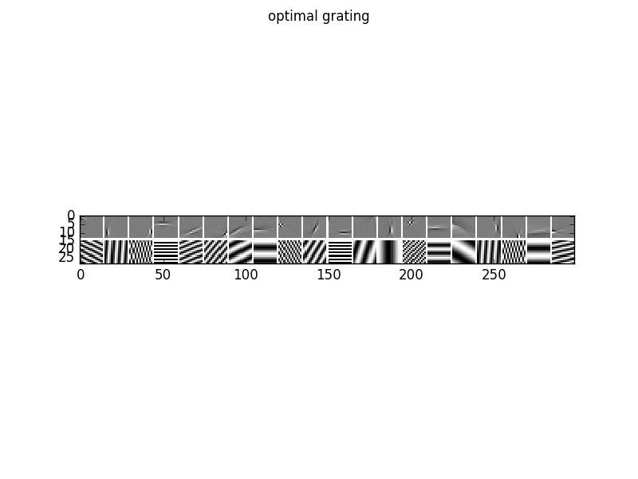
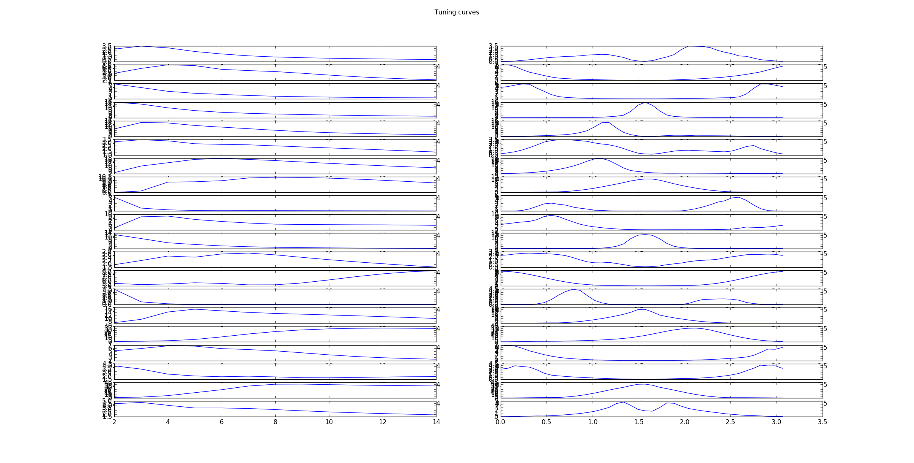
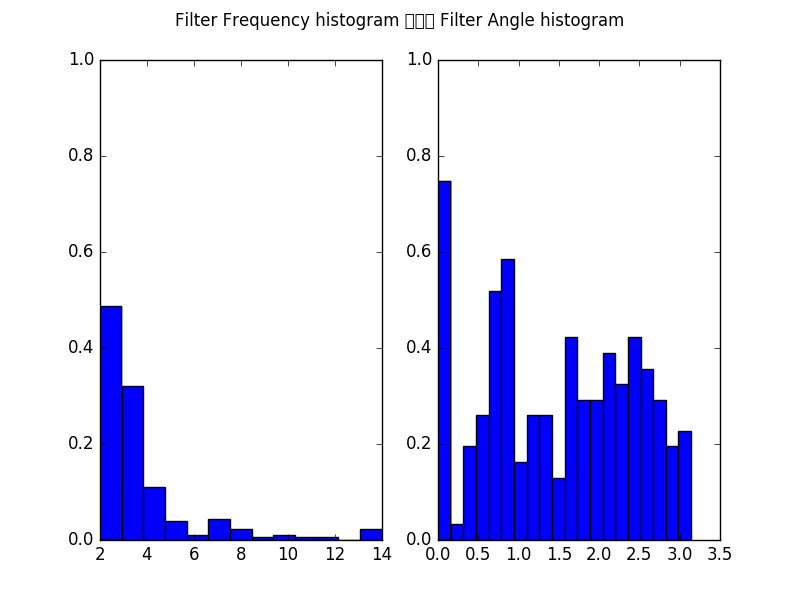

.. _ICA_Natural_Images:

Independent Component Analysis on a natural image patches
==========================================================

Example for Independent Component Analysis (`ICA <https://en.wikipedia.org/wiki/Principal_component_analysis>`_)
on natural image patches. The independent components (columns of the ICA projection matrix) of natural image patches are edge detector filters.

Theory
***********

If you are new on ICA and blind source separation, first see `ICA_2D_example <ICA_2D_example.html#ICA_2D_example>`__.

For a comparison of ICA and GRBMs on natural image patches see `Gaussian-binary restricted Boltzmann machines for modeling natural image statistics. Melchior et. al. PLOS ONE 2017 <http://doi.org/10.1371/journal.pone.0171015>`_.

Results
***********

The code_ given below produces the following output.

Visualization of 100 examples of the gray scale natural image dataset.

The corresponding whitened image patches.

The learned filters/independent components learned from the whitened natural image patches.

The log-likelihood on all data is:

.. code-block:: Python

   log-likelihood on all data: -260.064878919

To analyze the optimal response of the learn filters we can fit a Gabor-wavelet parametrized in angle and frequency, and plot
the optimal grating, here for 20 filters

as well as the corresponding tuning curves, which show the responds/activities as a function frequency in pixels/cycle (left) and angle in rad (right).

Furthermore, we can plot the histogram of all filters over the frequencies in pixels/cycle (left) and angles in rad (right).

See also `GRBM_natural_images <GRBM_natural_images.html#GRBM_natural_images>`__.
and `AE_natural_images <AE_natural_images.html#AE_natural_images>`__.

.. _code:

Source code
***********

.. figure:: images/download_icon.png
   :scale: 20 %
   :target: https://github.com/MelJan/PyDeep/blob/master/examples/ICA_natural_images.py

.. literalinclude:: ../../examples/ICA_natural_images.py