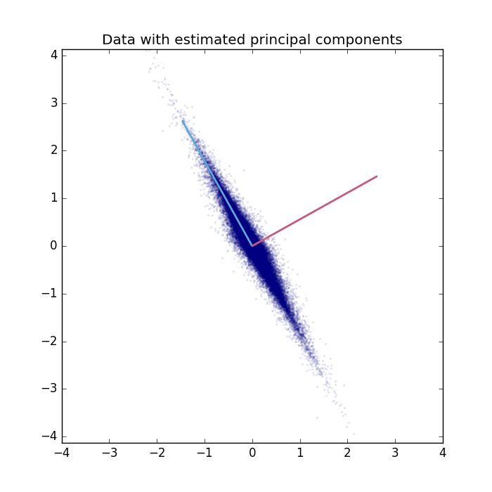
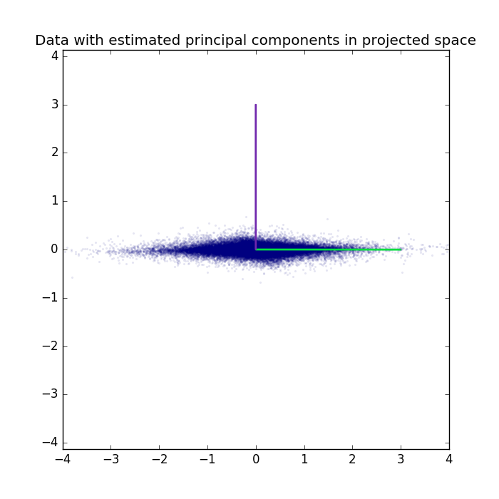
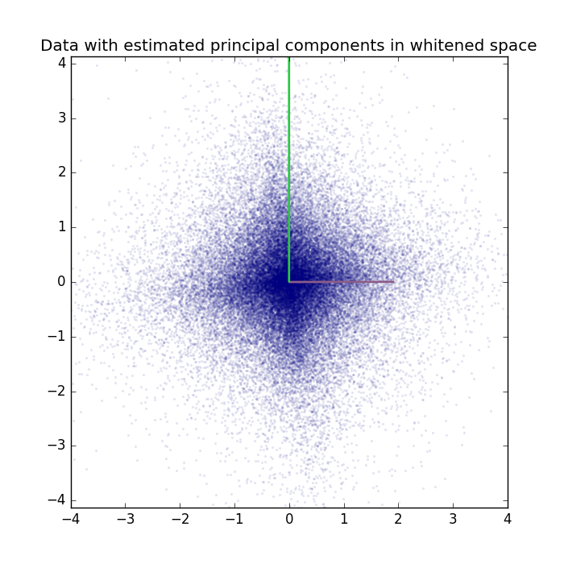

.. _PCA_2D_example:

Principal Component Analysis on a 2D example.
============================================

Example for Principal Component Analysis (`PCA <https://en.wikipedia.org/wiki/Principal_component_analysis>`_) on a linear 2D mixture.

Theory
***********

If you are new on PCA, a good theoretical introduction is given by the `Course Material <https://www.ini.rub.de/PEOPLE/wiskott/Teaching/Material/index.html>`_ in combination with the following video lectures.

.. raw:: html

    

      <iframe width="560" height="315" src="https://www.youtube.com/embed/9H-1FH1gn6w" frameborder="0" allowfullscreen></iframe>
    

Results
***********

The code_ given below produces the following output.

The data is plotted with the extracted principal components.

Data and extracted principal components can also be plotted in the projected space.

The PCA-class can also perform whitening. Data and extracted principal components are plotted in the whitened space.

For a real-world application see the `PCA_eigenfaces <PCA_eigenfaces.html#PCA_eigenfaces>`__ example.

.. _code:

Source code
***********

.. figure:: images/download_icon.png
   :scale: 20 %
   :target: https://github.com/MelJan/PyDeep/blob/master/examples/PCA_2D.py

.. literalinclude:: ../../examples/PCA_2D.py