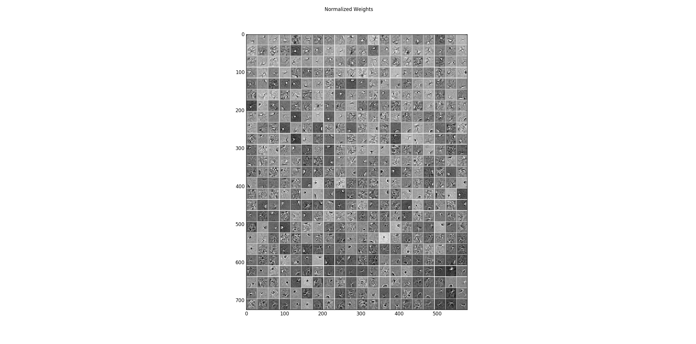
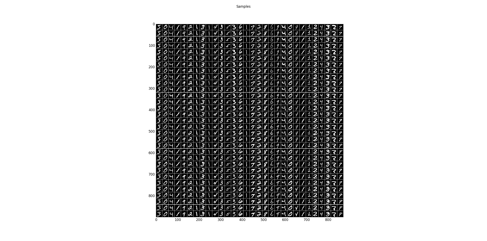

Big binary RBM on MNIST
==========================================================

Example for training a centered and normal binary restricted Boltzmann machine on the MNIST handwritten digit dataset.
The model has 500 hidden units, is trained for 200 epochs (That takes a while, reduce it if you like), and the
log-likelihood is evaluated using annealed importance sampling.

It allows to reproduce the results from the publication `How to Center Deep Boltzmann Machines. Melchior et al. JMLR 2016. <http://jmlr.org/papers/v17/14-237.html>`_. Running the code as it is for example reproduces a single trial of the plot in Figure 9. (PCD-1) for $dd^b_s$.

Theory
***********

If you are new on RBMs, first see `RBM_MNIST_small <RBM_MNIST_small.html#RBM_MNIST_small>`__.

For an analysis of the advantage of centering in RBMs see `How to Center Deep Boltzmann Machines. Melchior et al. JMLR 2016. <http://jmlr.org/papers/v17/14-237.html>`_

Results
***********

The code_ given below produces the following output.

Learned filters of a centered binary RBM with 500 hidden units on the MNIST dataset.
The filters have been normalized such that the structure is more prominent.

Sampling results for some examples. The first row shows some training data and the following rows are the results after one Gibbs-sampling step starting from the previous row.

The log-Likelihood is estimated using annealed importance sampling (optimistic) and reverse annealed importance sampling (pessimistic).

.. code-block:: Python

   Training time:         1:18:12.536887
   AIS Partition:         968.971299741 (LL train: -82.5839850187, LL test: -84.8560508601)
   reverse AIS Partition: 980.722421486 (LL train: -94.3351067638, LL test: -96.6071726052)

Now we have a look at the filters learned for a normal binary RBM with 500 hidden units on the MNIST dataset.
The filters have also been normalized such that the structure is more prominent.

.. figure:: images/BRBM_big_normal_weights.png
   :scale: 35 %
   :alt: weights centered
   :align: center

Sampling results for some examples. The first row shows the training data and the following rows are the results after one Gibbs-sampling step starting from the previous row.

.. code-block:: Python

   Training time:         1:16:37.808645
   AIS Partition:         959.098055647 (LL train: -128.009777345, LL test: -130.808849443)
   reverse AIS Partition: 958.714291654 (LL train: -127.626013352, LL test: -130.42508545)

The structure of the filters and the samples are quite similar. But the samples for the centered RBM look a bit sharper
and the log-likelihood is significantly higher. Note that you can reach better values with normal RBMs but this highly
depends on the training setup, whereas centering is rather robust to that.

For real valued input see also `GRBM_natural_images <GRBM_natural_images.html#GRBM_natural_images>`__.

.. _code:

Source code
***********

.. figure:: images/download_icon.png
   :scale: 20 %
   :target: https://github.com/MelJan/PyDeep/blob/master/examples/RBM_MNIST_big.py

.. literalinclude:: ../../examples/RBM_MNIST_big.py