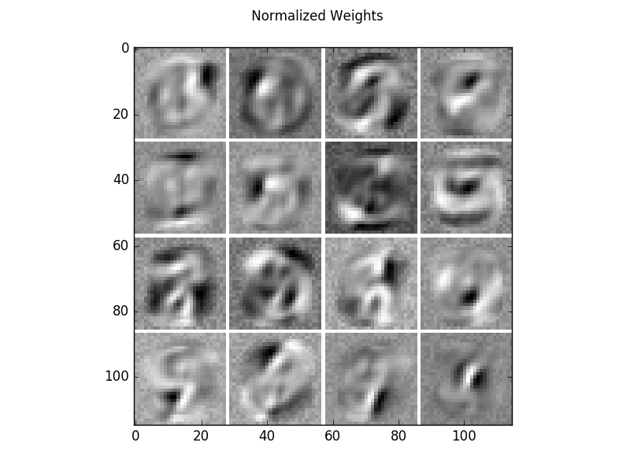
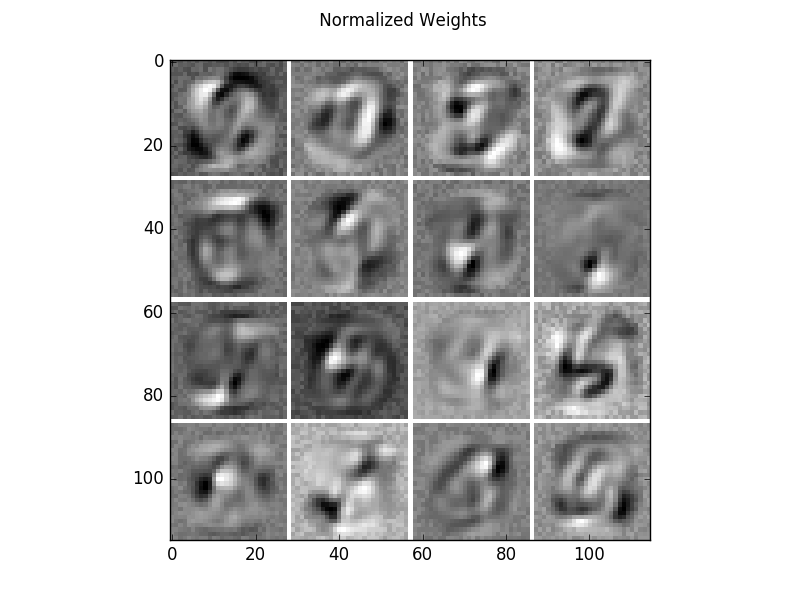
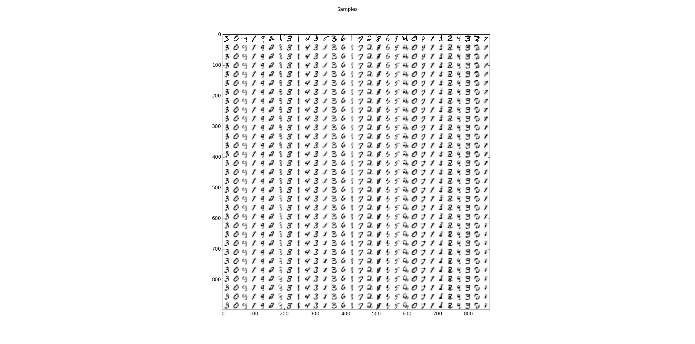
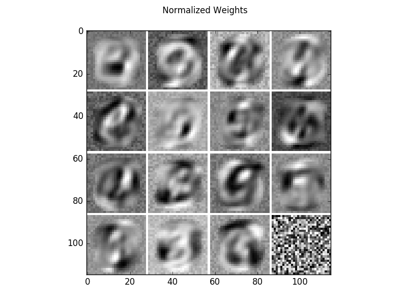
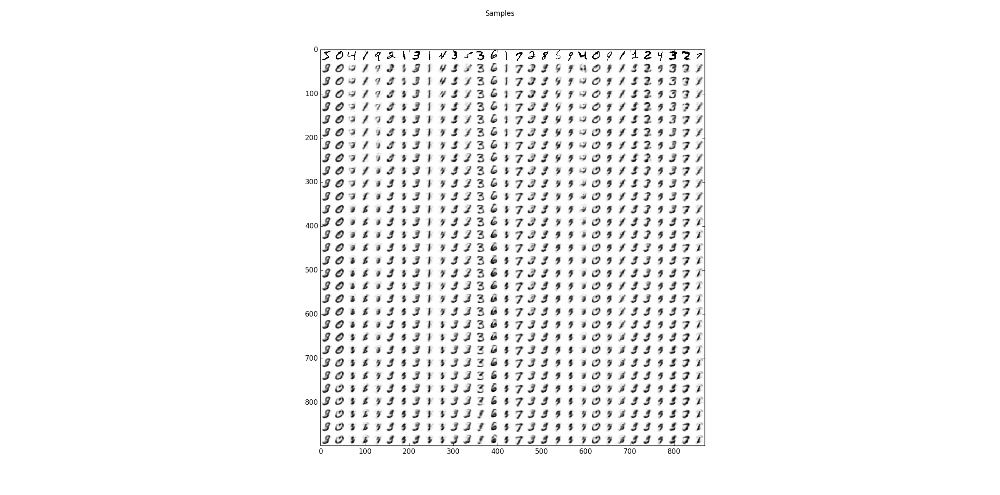

Small binary RBM on MNIST
==========================================================

Example for training a centered and normal Binary Restricted Boltzmann machine on the MNIST handwritten digit dataset and its flipped version (1-MNIST).
The model is small enough to calculate the exact log-Likelihood. For comparision annealed importance sampling and reverse annealed importance sampling are used for estimating the partition function.

It allows to reproduce the results from the publication `How to Center Deep Boltzmann Machines. Melchior et al. JMLR 2016. <http://jmlr.org/papers/v17/14-237.html>`_

Theory
***********

For an analysis of the advantage of centering in RBMs see `How to Center Deep Boltzmann Machines. Melchior et al. JMLR 2016. <http://jmlr.org/papers/v17/14-237.html>`_

If you are new on RBMs, you can have a look into my `master's theses <https://www.ini.rub.de/PEOPLE/wiskott/Reprints/Melchior-2012-MasterThesis-RBMs.pdf>`_

A good theoretical introduction is also given by the `Course Material <https://www.ini.rub.de/PEOPLE/wiskott/Teaching/Material/index.html>`_ in combination with the following video lectures.

.. raw:: html

    

      <iframe width="560" height="315" src="https://www.youtube.com/embed/bMaITeXhOaE" frameborder="0" allowfullscreen></iframe>
    

and

.. raw:: html

    

      <iframe width="560" height="315" src="https://www.youtube.com/embed/nyk5XUklb5M" frameborder="0" allowfullscreen></iframe>
    

Results
***********

The code_ given below produces the following output.

Learned filters of a centered binary RBM on the MNIST dataset.
The filters have been normalized such that the structure is more prominent.

.. figure:: images/BRBM_small_centered_weights.png
   :scale: 50 %
   :align: center
   :alt: weights centered

Sampling results for some examples. The first row shows the training data and the following rows are the results after one Gibbs-sampling step starting from the previous row.

.. figure:: images/BRBM_small_centered_samples.png
   :scale: 35 %
   :alt: samples centered
   :align: center

The Log-Likelihood is calculated using the exact Partition function, an annealed importance sampling estimation (optimistic) and reverse annealed importance sampling estimation (pessimistic).

.. code-block:: Python

   True Partition:         310.18444704  (LL train: -143.149739926, LL test: -142.56382054)
   AIS Partition:          309.693954732 (LL train: -142.659247618, LL test: -142.073328232)
   reverse AIS Partition:  316.30736142  (LL train: -149.272654305, LL test: -148.686734919)

The code can also be executed without centering by setting

.. code-block:: python

   update_offsets = 0.0

Resulting in the following weights and sampling steps.

.. figure:: images/BRBM_small_normal_samples.png
   :scale: 35 %
   :alt: samples normal
   :align: center

The Log-Likelihood for this model is worse (6.5 nats lower).

.. code-block:: Python

   True Partition:         190.951945786 (LL train: -149.605105935, LL test: -149.053303204)
   AIS Partition:          191.095934868 (LL train: -149.749095017, LL test: -149.197292286)
   reverse AIS Partition:  191.192036843 (LL train: -149.845196992, LL test: -149.293394261)

Further, the models can be trained on the flipped version of MNIST (1-MNIST).

.. code-block:: python

   flipped = True

While the centered model has a similar performance on the flipped version,

.. code-block:: Python

   True Partition:         310.245654321 (LL train: -142.812529437, LL test: -142.08692014)
   AIS Partition:          311.177617039 (LL train: -143.744492155, LL test: -143.018882858)
   reverse AIS Partition:  309.188366165 (LL train: -141.755241282, LL test: -141.029631984)

The normal RBM has not.

.. code-block:: Python

   True Partition:         3495.27200694 (LL train: -183.259299994, LL test: -183.359988079)
   AIS Partition:          3495.25941111 (LL train: -183.246704163, LL test: -183.347392249)
   reverse AIS Partition:  3495.20117625 (LL train: -183.188469308, LL test: -183.289157393)

For a large number of hidden units see `RBM_MNIST_big <RBM_MNIST_big.html#RBM_MNIST_big>`__.

.. _code:

Source code
***********

.. figure:: images/download_icon.png
   :scale: 20 %
   :target: https://github.com/MelJan/PyDeep/blob/master/examples/RBM_MNIST_small.py

.. literalinclude:: ../../examples/RBM_MNIST_small.py