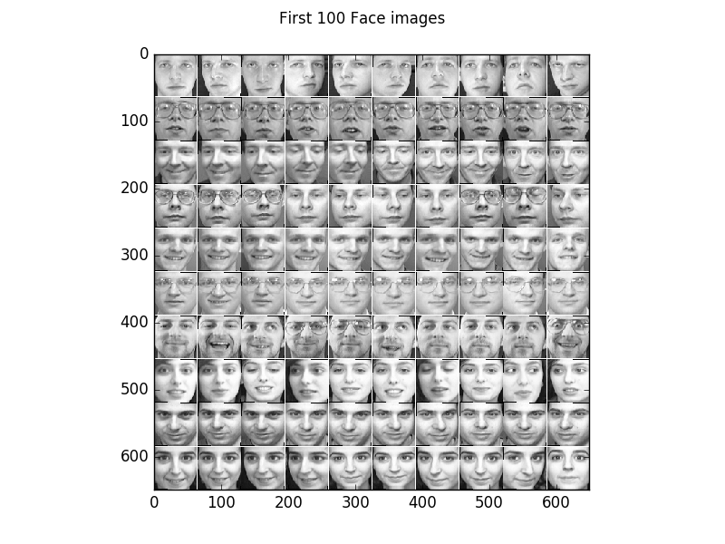
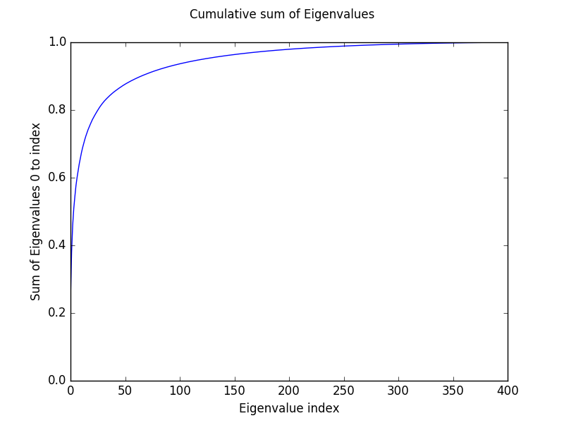
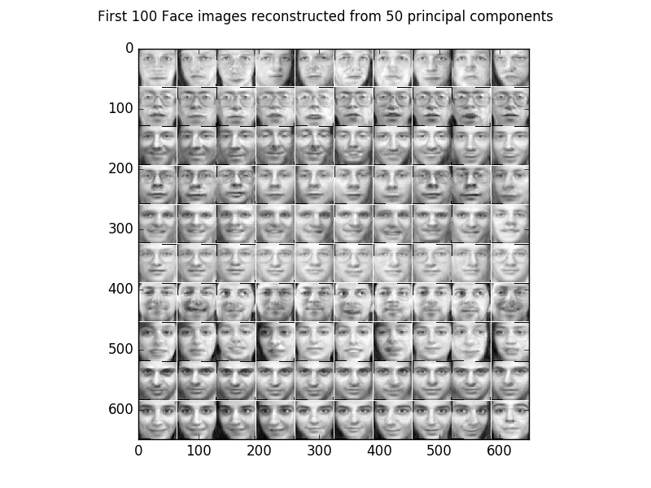

Eigenfaces
===========

Example for Principal Component Analysis (PCA) on face images also known as `Eigenfaces <https://en.wikipedia.org/wiki/Eigenface>`_

The code_ given below produces the following output.

Some examples of the face images of the olivetti face dataset.

The first 100 principal components extracted from the dataset. The components focus on characteristics like glasses, lighting direction, nose shape, ...

.. image:: images/components_faces.png
   :scale: 75 %
   :alt: Principal components of teh face dataset

The cumulative sum of the Eigenvalues show how 'compressable' the dataset is.

For example using only the first 50 Eigenvectors retains 87,5 % of the variance of the data and the reconstructed images look as follows.

For 200 Eigenvectors we retain 98,0 % of the variance of the data and the reconstructed images look as follows.

Comparing the results with the original images shows that the data can be compressed to 50 dimensions with an acceptable error.

.. _code:

Source code
***********

.. figure:: images/download_icon.png
   :scale: 20 %
   :target: https://github.com/MelJan/PyDeep/blob/master/examples/eigenfaces.py

.. literalinclude:: ../../examples/eigenfaces.py